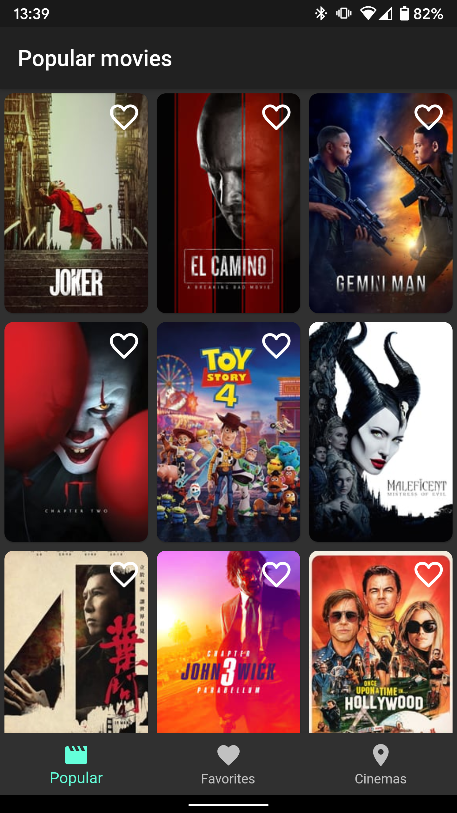
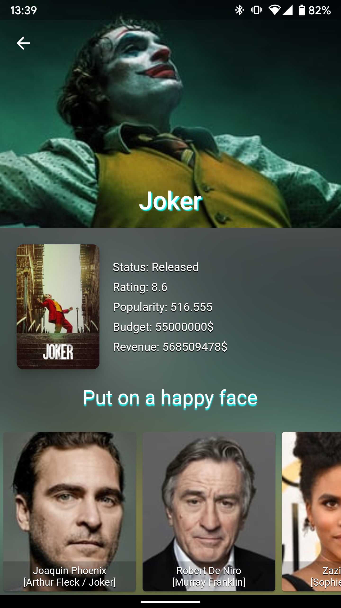
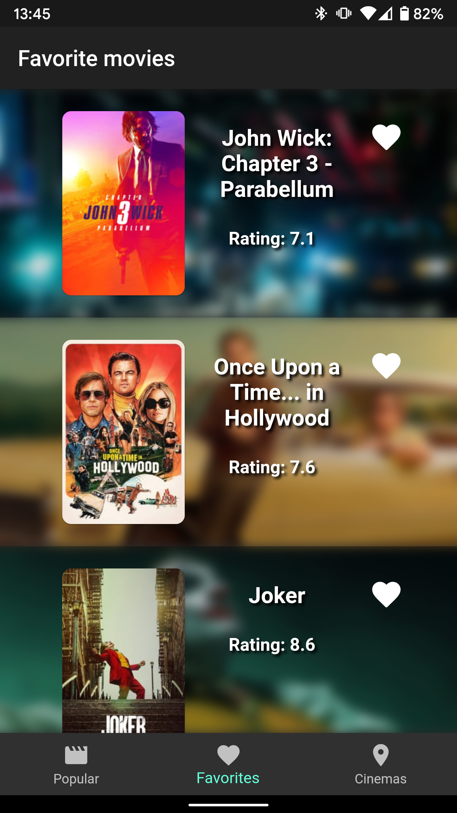
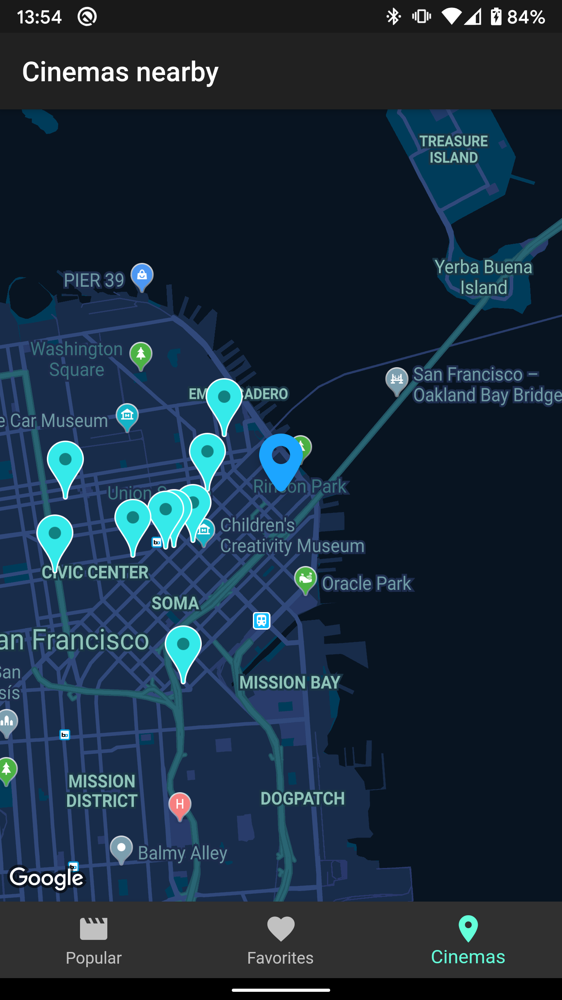

# fmovies - Flutter showcase app

fmovies is a multiplatform app for browsing new movies and fetching 
nearest cinemas. It is completely written in Dart and Flutter framework
using [BLoC][https://www.didierboelens.com/2018/08/reactive-programming---streams---bloc] 
pattern. 

 
 



This app is not released in production because it is just a showcase
what you can do with Flutter.We started this project as a playground for 
learning Dart and Flutter framework. 

## Features
- list of new movies - Now playing movies from TMDB API
- favorites list - List of favorite movies from app database
- map with nearby cinemas - Google map connected with Places API to fetch 
nearest cinemas
- movie details - Movie detail from TMDB API


## Building the project
First of all you will need to setup your development environment. To 
do that go to the official Flutter 
[documentation][https://flutter.dev/docs/get-started/install] and follow
ve.
After `flutter doctor` says everything is fine follow next steps:
1. Clone the project to your machine
2. Open project with your IDE
3. Run `flutter packages get`
4. Add API key for Google Maps
- Android: Specify your API key in the `AndroidManifest.xml`
```xml
<manifest>
  <application>
    <meta-data android:name="com.google.android.geo.API_KEY"
               android:value="YOUR KEY HERE"/>
   </application>
</manifest>
```
- iOS: Specify your API key in the application delegate ios/Runner/AppDelegate.swift:
```swift
import UIKit
import Flutter
import GoogleMaps

@UIApplicationMain
@objc class AppDelegate: FlutterAppDelegate {
  override func application(
    _ application: UIApplication,
    didFinishLaunchingWithOptions launchOptions: [UIApplicationLaunchOptionsKey: Any]?
  ) -> Bool {
    GMSServices.provideAPIKey("YOUR KEY HERE")
    GeneratedPluginRegistrant.register(with: self)
    return super.application(application, didFinishLaunchingWithOptions: launchOptions)
  }
}
```           
5. Create new file `secrets.json` in `/assets` directory and add TMDB 
API key and Places API key
```json
{
  "tmdb_key": "random_key",
  "places_key": "random_key"
}
```
6. Run the app on your simulator/emulator or device.

## Plugins

- [flutter_bloc][https://pub.dev/packages/flutter_bloc] - A Flutter 
package that helps implement the BLoC pattern.
- [google_maps_flutter][https://pub.dev/packages/google_maps_flutter] - 
A Flutter plugin that provides a Google Maps widget.
- [dio][https://pub.dev/packages/dio] - A powerful Http client for Dart, 
which supports Interceptors, Global configuration, FormData, Request 
Cancellation, File downloading, Timeout etc.
- [get_it][https://pub.dev/packages/get_it] - Simple Service Locator for 
Dart and Flutter projects with some additional goodies highly inspired 
by Splat. 
- [geolocator][https://pub.dev/packages/geolocator] - A Flutter 
geolocation plugin which provides easy access to the platform specific 
location services (FusedLocationProviderClient or if not available the 
LocationManager on Android and CLLocationManager on iOS). 
- [moor_flutter][https://pub.dev/packages/moor_flutter] - Moor is an 
easy to use, reactive persistence library for Flutter apps. Define 
your database tables in pure Dart and enjoy a fluent query API, 
auto-updating streams and more!
- [flare_flutter][https://pub.dev/packages/flare_flutter] - Flutter 
runtime for Flare, depends on flare_dart.
- [location_permissions][https://pub.dev/packages/location_permissions] -
The Location Permissions plugin for Flutter. This plugin provides a 
cross-platform (iOS, Android) API to check and request permissions to 
access location services.
- [auto_size_text][https://pub.dev/packages/auto_size_text] - Flutter 
widget that automatically resizes text to fit perfectly within its bounds.
- [animated_text_kit][https://pub.dev/packages/animated_text_kit] - A 
flutter package which contains a collection of some cool and awesome 
text animations.
